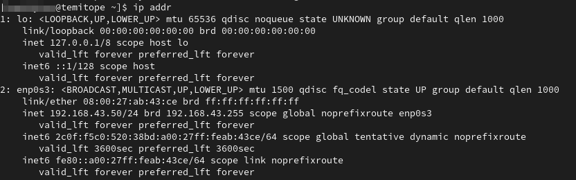
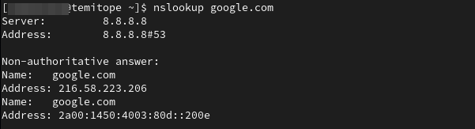
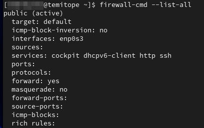
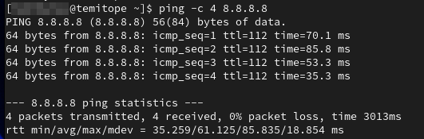
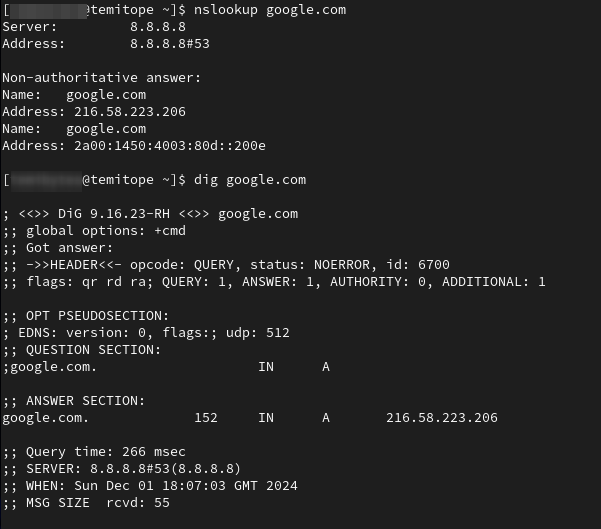
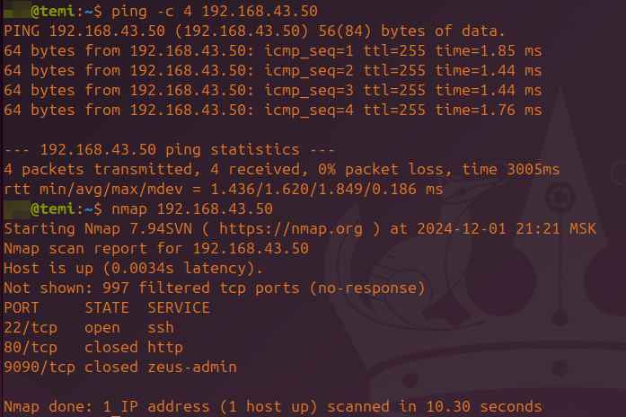

## Network Configuration
### Static IP Configuration
* **IP Address:**  ```192.168.43.50```
* **Subnet Mask:** ```/24```
* **Default Gateway:** ```192.168.43.142```
* **DNS Server:** ```8.8.8.8```
#### Commands Used
```
nmcli connection modify esp0s3 ipv4.addresses 192.168.43.50/24 ipv4.gateway 192.168.43.142 ipv4.dns 8.8.8.8 ipv4.method manual
```
#### Verification
* **IP Address:** 
```
ip addr show
```

* **DNS Resolution:** 
```
nslookup google.com
```


## Firewall Configuration
### Rules Applied
1. Allow SSH:
```
firewall-cmd --zone=public --add-service=ssh --permanent   
```
2. Allow HTTP:   
```
firewall-cmd --zone=public --add-service=http --permanent
```
#### Verification
* Command:
```
firewall-cmd --list-all
```

##### Purpose of Rules
* **SSH:** Enables remote login and secure administration.
* **HTTP:** Allows hosting of web services.

## Test Results
### 1. Ping Test
* Command:
```
ping -c 4 8.8.8.8
```

### 2. DNS Test
* Command:
```
nslookup google.com
dig google.com
```

### 3. Firewall Test
* Command:
```
ping 192.168.43.50
nmap 192.168.43.50
```


## Link to Post
[# Building Your First Linux Server: A Beginner’s Guide to Networking and Firewalls](https://temibytes.medium.com/building-your-first-linux-server-a-beginners-guide-to-networking-and-firewalls-87f22195f038)
